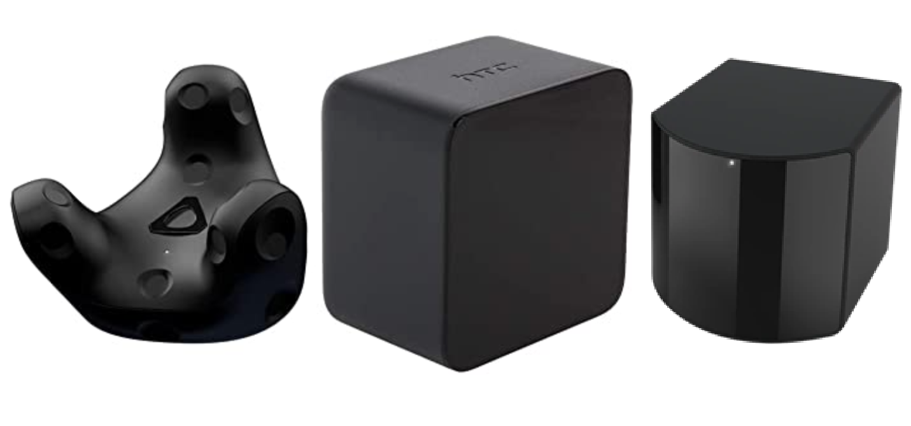

# Vive_Tracker
Vive Tracker 6 DOF Tracking
<p align= "center">
<br/><br/>
</p>

> - HTC Base Station and Vive Tracker 3.0
> - Tracking: Support for SteamVR BS1.0 and BS2.0 
> - Weight: 75g
> - Dimensions: 70.9 x 79.0 x 44.1 mm
> - Battery Life: 7.5 hours
> - Field of view: 240 Degrees 
> - Components: Vive Tracker, Dongle, Dongle Cradle (USB-C), USB cable

## Installation

### Option 1: Install from source (recommended for development)
Clone the repository and install in editable mode:
```bash
git clone https://github.com/snuvclab/Vive_Tracker.git
cd Vive_Tracker
pip install -e .
```

### Option 2: Install as a package
```bash
git clone https://github.com/snuvclab/Vive_Tracker.git
cd Vive_Tracker
pip install .
```

### Option 3: Install directly from GitHub (when published)
```bash
pip install git+https://github.com/snuvclab/Vive_Tracker.git
```

> Note: This code was developed on Ubuntu 22.04 with Python 3.10. Later versions should work, but have not been tested.<br/>
> It's recommended to use a virtual environment:

```bash
conda create -n vivetracker python=3.10
conda activate vivetracker
```

## Setting up SteamVR
> Install Steam:
```
https://cdn.cloudflare.steamstatic.com/client/installer/steam.deb
sudo dpkg -i YourDownloadDirectory/steam_latest.deb
sudo apt-get update
sudo apt upgrade
```

## Usage

### Command Line Interface
After installation, you can use the `vive-tracker` command:

```bash
# Run with default settings (30 Hz, tracker_1)
vive-tracker

# Specify frequency
vive-tracker -f 60

# Specify tracker device
vive-tracker -t tracker_2

# Combine options
vive-tracker -f 30 -t tracker_1
```

### Python API
You can also use the package in your Python code:

```python
from vive_tracker import ViveTrackerModule

# Initialize the tracker
v_tracker = ViveTrackerModule()
v_tracker.print_discovered_objects()

# Get a specific tracker
tracker = v_tracker.devices["tracker_1"]

# Get pose data
pose_euler = tracker.get_pose_euler()  # Returns [x, y, z, yaw, pitch, roll]
pose_quaternion = tracker.get_pose_quaternion()  # Returns [x, y, z, r_w, r_x, r_y, r_z]
pose_matrix = tracker.get_pose_matrix()  # Returns 3x4 transformation matrix
vel = tracker.get_velocity() # Return linear and angular velocity (x,y,z, rx, ry, rz)

# Get device information
serial = tracker.get_serial()
model = tracker.get_model()
battery = tracker.get_battery_percent()
```

### Legacy Script
The original `run_tracker.py` script is still available for backward compatibility:
```bash
python run_tracker.py -f 30
```

## Output Format
> - Command line output: `timestamp x y z yaw pitch roll`
> - Euler angles: yaw, pitch, roll (in degrees)
> - Position: x, y, z (in meters)

## Package Structure
```
vive_tracker/
├── vive_tracker/           # Main package directory
│   ├── __init__.py        # Package initialization
│   ├── tracker.py         # Core tracking module
│   └── cli.py             # Command-line interface
├── run_tracker.py         # Legacy script (backward compatibility)
├── setup.py               # Package setup file
├── setup.cfg              # Package configuration
├── pyproject.toml         # Modern Python packaging
├── requirements.txt       # Dependencies
└── README.md              # This file
```

## Visualization
To be updated...


